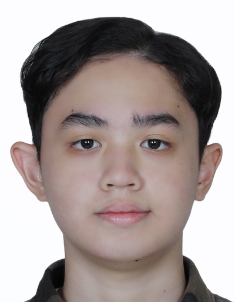
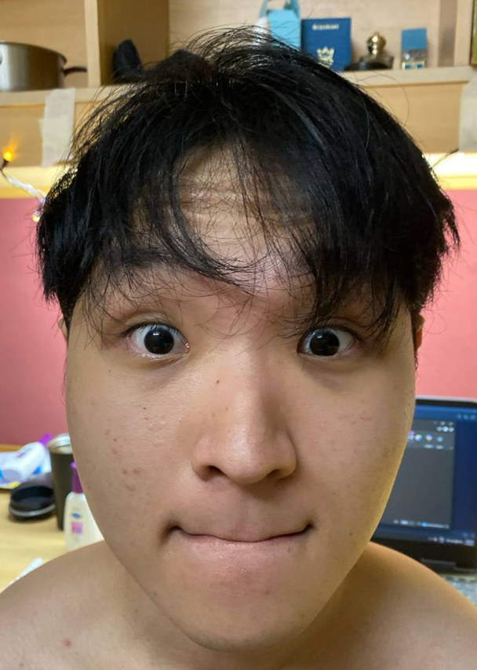

# About Us

We are a team based in the [School of Computing, National University of Singapore](http://www.comp.nus.edu.sg).

You can reach us at the email `seer[at]comp.nus.edu.sg`

## Project team

### Raghad Altelmessani

[[github](https://github.com/altelm)]

* Role: team member

### Fathan Mubina

[[homepage](https://www.fathmubina.com/)]
[[github](https://github.com/memoflora)]
[[portfolio](team/memoflora.md)]

* Role: Developer
* Responsibilities: Backend

### Yifei

[github]: https://github.com/phfabs
[[github](https://github.com/phfabs)]
[[portfolio](team/phfabs)]

* Role: Developer
* Responsibilities
    * Implementation
    * Documentation

### Rachel

[[homepage](http://www.comp.nus.edu.sg/~damithch)]
[[github](http://github.com/e1356231)]
[[portfolio](team/e1356231.md)]

* Role: Developer
* Responsibilities: UI

### Shu Xian

[[github](http://github.com/kip1425)]
[[portfolio](team/johndoe.md)]

* Role: Developer
* Responsibilities: UX
