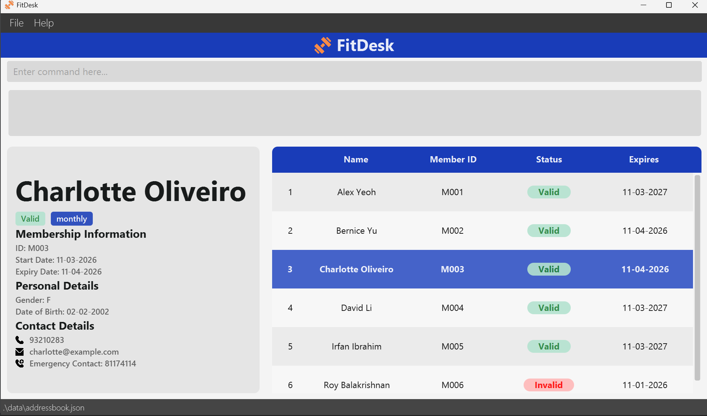
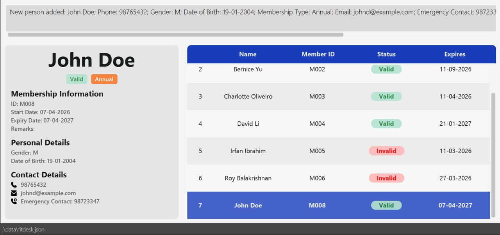
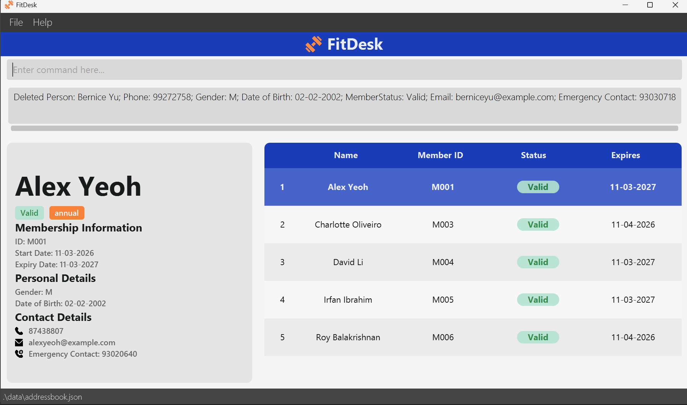
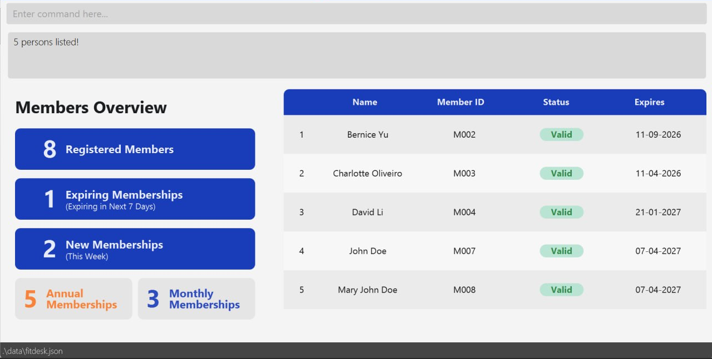
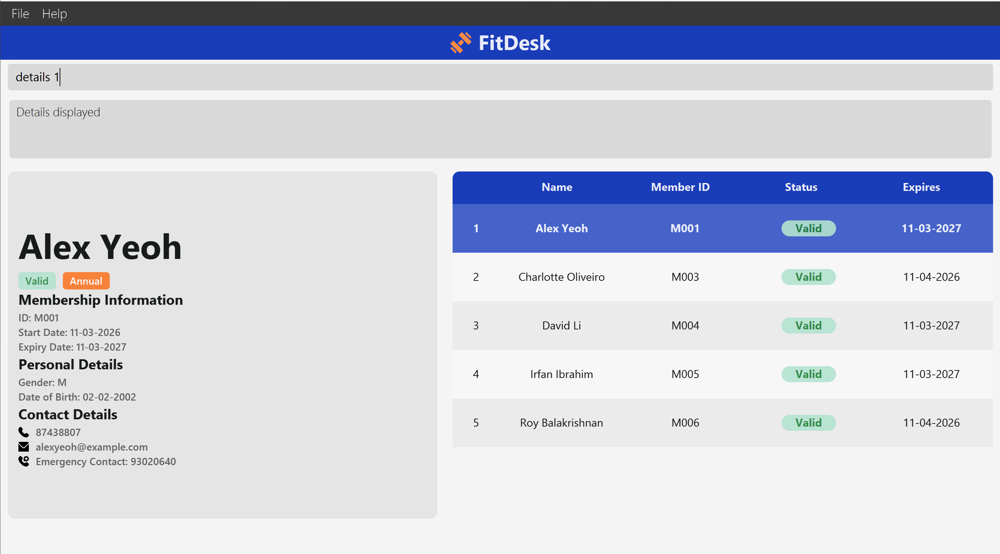
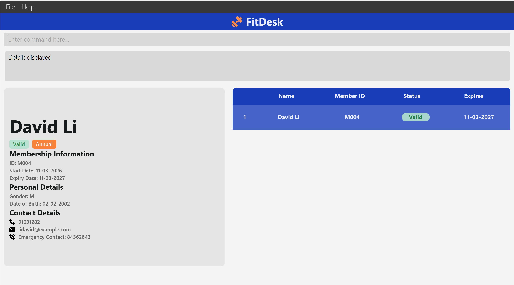
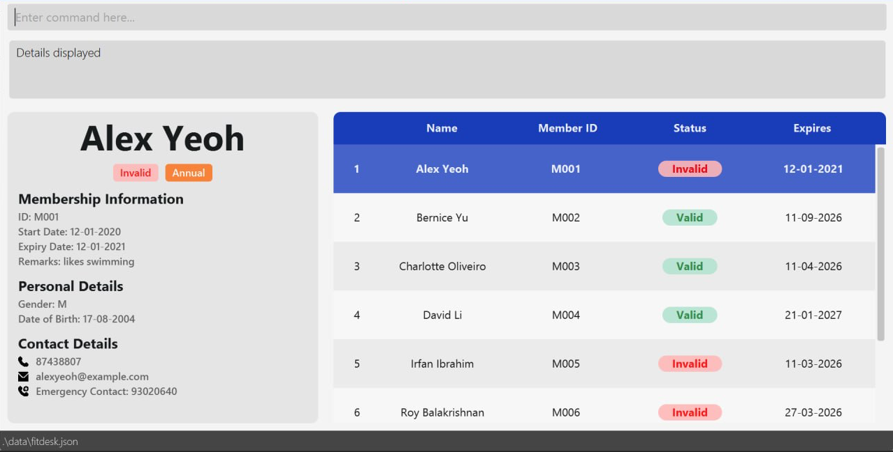

# FitDesk User Guide

## App Overview
FitDesk is a **desktop app for front-desk receptionists** at small-to-medium private fitness gyms managing member registrations and daily check-ins. Tailored for **fast, keyboard-centric workflows**, FitDesk empowers receptionists to work more efficiently, reducing wait times and increasing productivity.

### Supported Operating Systems
1. macOS
2. Windows
3. Linux
<!-- * Table of Contents -->
<page-nav-print />

--------------------------------------------------------------------------------------------------------------------

## Quick Start

### Setup Instructions

1. **Ensure you have Java `17` or above** installed on your computer.<br>
2. **Platform-specific installation guides:**
   - **Mac:** [Installation guide](https://se-education.org/guides/tutorials/javaInstallationMac.html)
   - **Windows:** [Installation guide](https://se-education.org/guides/tutorials/javaInstallationWindows.html)
   - **Linux:** [Installation guide](https://se-education.org/guides/tutorials/javaInstallationLinux.html) <br>

1. **Download the latest `.jar` file** from [here](https://github.com/AY2526S2-CS2103T-W08-3/tp/releases).

1. **Set up your home folder:**

   Copy the `.jar` file to the folder you want to use as FitDesk's _home folder_.

1. **Run the application:**
   1. Open a **command terminal**:
      - **Windows**: Press `Windows key + R`, type `cmd`, and press Enter
      - **Mac/Linux**: Open the **Terminal** app
   
   2. Navigate to the folder where the `.jar` file was saved
      ```bash
      cd path/to/your/folder
   3. Run the application using:
      ```bash
      java -jar fitdesk.jar
   4. The application should launch shortly after.

A GUI similar to the below should appear in a few seconds. Note how the app contains some sample data.<br>



--------------------------------------------------------------------------------------------------------------------

### Using the Application

1. Type a command into the **command box**.
2. Press **Enter** to execute it. 

    For example:
    ```bash
       help
    ```
   This will open the user guide in the default browser, if your OS does not support it a help window will open.
   > 💡 **Tip:** 
   > 
    >- Use the **Up** and **Down** arrow keys to cycle through previously entered commands.
    >- Press **Tab** in the command box to auto-complete command words, field prefixes, and values.
    >- To navigate back to the overview from a member's details, click on the member in the list.
---
**Try these example commands:**

   * List all members: `list`

   * Add a member named `John Doe` to FitDesk:

   ```bash
   add n/John Doe p/98765432 g/M d/19-01-2004 m/annual e/johnd@example.com ec/98723347
   ```

   * Delete the 3rd member shown in the current list: `delete 3`

   * Delete all members: `clear` 

   * Exit the app: `exit`

**Learn More**

Refer to the [**Commands**](#features) section below for full details of each command.

--------------------------------------------------------------------------------------------------------------------

## Commands

FitDesk supports the following commands. Click on a command to learn more.

> 💡 **Tip:** See the [**Keyboard Features**](#keyboard-features) section for shortcuts like tab completion, command history, and member list navigation.

<box type="info" seamless>

**Notes about the command format:**<br>

* Words in `UPPER_CASE` are the parameters to be supplied by the user.<br>
  e.g. in `add n/NAME`, `NAME` is a parameter which can be used as `add n/John Doe`.

* Items in square brackets are optional.<br>
  e.g. `add n/NAME p/PHONE_NUMBER ... [j/JOIN_DATE]` can be used with or without the join date.

* Parameters can be in any order.<br>
  e.g. if the command specifies `n/NAME p/PHONE_NUMBER`, `p/PHONE_NUMBER n/NAME` is also acceptable.

* Each field prefix may only be specified once per command. Specifying the same prefix more than once will result in an error.<br>
  e.g. `add n/John n/Jane ...` is invalid.

* Extraneous parameters for commands that do not take in parameters (such as `help`, `list`, `exit` and `clear`) will be ignored.<br>
  e.g. if the command specifies `help 123`, it will be interpreted as `help`.

* If you are using a PDF version of this document, be careful when copying and pasting commands that span multiple lines as space characters surrounding line-breaks may be omitted when copied over to the application.
</box>


## Basic Commands

### Viewing help: `help`

Shows a message explaining how to access the help page through a pop-up window.

Format: `help`

Example:
* `help`

    

    Help message is shown 


### Adding a member: `add`

Adds a member to the member list.

Format: `add n/NAME p/PHONE_NUMBER g/GENDER d/DATE_OF_BIRTH m/MEMBERSHIP_TYPE e/EMAIL ec/EMERGENCY_CONTACT [j/JOIN_DATE] [r/REMARK]`

<box type="tip" seamless>

**Tip:** Membership types only include "Monthly" or "Annual"
</box>

* Each **phone number** and **email** must be unique in the member list (no two members may share the same phone or the same email).
* **Names** do not need to be unique; different members are allowed to have the same name as long as their phone and email differ.
* If `j/JOIN_DATE` is omitted, the member's join date defaults to the current date.
* If `r/REMARK` is omitted, the remark defaults to empty.
* If you try to add someone whose phone or email matches an existing member, the command is rejected and the error message indicates which field is duplicated.

Example:
* `add n/John Doe p/98765432 g/M d/19-01-2004 m/annual e/johnd@example.com ec/98723347`

    

    A new member `John Doe` is added to the member list


### Listing all members : `list`

Shows a list of all members in the list.

Format: `list`

Example:
* `list`

    

    All members are listed


### Editing a member: `edit`

Edits an existing member in the list.

Format: `edit INDEX [n/NAME] [p/PHONE_NUMBER] [g/GENDER] [d/DATE_OF_BIRTH] [e/EMAIL] [ec/EMERGENCY_CONTACT] [r/REMARK]`

* Edits the member at the specified `INDEX`. The index refers to the index number shown in the displayed member list. The index **must be a positive integer** 1, 2, 3, …​
* At least one of the optional fields must be provided.
* Existing values will be updated to the input values.
* After editing, the member’s **phone** and **email** must still be unique among all other members (same rules as `add`). **Names** may match another member’s name.

Example:
*  `edit 7 p/91234567 e/johndoe@example.com`

    
    
    The phone number and email address of the 7th member are edited to be `91234567` and `johndoe@example.com` respectively


### Deleting a member : `delete`

Deletes the specified member from the list.

Format: `delete INDEX`

* Deletes the person at the specified `INDEX`.
* The index refers to the index number shown in the displayed person list.
* The index **must be a positive integer** 1, 2, 3, …

Example:
* `list` followed by `delete 2`
  1. `list`
  
        
  
  2. `delete 2`
  
        
  
        The 2nd member is deleted from the list


## Search & Filter

### Locating members by keyword: `find`

Finds members whose fields contain the search query as a substring.

Format: `find QUERY`

* The search is case-insensitive. e.g `hans` will match `Hans`
* Only some text-based fields are searched: name, phone, email, emergency contact, membership type, member ID, and remark.
* Can take any input as the query, including special characters and spaces.
* The entire query is matched as a literal substring against each field.
  e.g. `find john doe` will only return members whose field contains `"john doe"`, not members with just `john` or just `doe`

Examples:
* `find john doe`

    

    Members whose name (or other field) contains `john doe` are listed

* `find 9123` returns members whose phone number or another field contains `9123`


### Filtering members by fields: `filter`

Filters member list and displays members who have fields matching the given attribute.

Format: `filter [s/STATUS] [g/GENDER] [m/MEMBERSHIP_TYPE] [age>/AGE] [age</AGE] [age=/AGE] [j>/DATE] [j</DATE] [j=/DATE] [exp>/DATE] [exp</DATE] [exp=/DATE]`

* Each prefix may only be specified once. Specifying the same prefix more than once is an error.
* For each date/age field, operators may be combined as follows:
  * `>/` + `</` — range, e.g. `age>/20 age</30` finds members aged strictly between 20 and 30
  * `>/` + `=/` (same value) — greater than or equal, e.g. `age>/20 age=/20` finds members aged 20 or older
  * `</` + `=/` (same value) — less than or equal, e.g. `age</30 age=/30` finds members aged 30 or younger
  * All three operators together are not allowed.

Example:
* `filter s/valid`

    

    Members with valid memberships are listed


## Member Management

### Viewing the details of a person : `details`

Shows the details of the specified member from the list.

Format: `details INDEX`

* Shows the details of the person at the specified `INDEX`.
* The index refers to the index number shown in the displayed person list.
* The index **must be a positive integer** 1, 2, 3, …

Examples:
* `list` followed by `details 1`
  1. `list`
  
        
  
  2. `details 1`
  
        
  
        The 1st member's details are shown in the list
  
* `find David` followed by `details 1`

    

    The 1st member's details are shown in the `find` command result.


### Adding a remark to a member : `remark`

Adds or edits a remark for the specified member.

Format: `remark INDEX r/[REMARK]`

* Edits the remark of the member at the specified `INDEX`. The index refers to the index number shown in the displayed member list. The index **must be a positive integer** 1, 2, 3, …
* Existing remark will be overwritten by the input.
* Providing an empty remark (i.e. `r/` with nothing after it) removes the remark from the member.
* The `r/` prefix may only be specified once.

Examples:
* `remark 1 r/likes swimming`

    

    Remark `likes swimming` is added to the 1st member.


### Renewing a membership: `renew`

Renews specified member's membership.

Format: `renew INDEX [m/MEMBERSHIP_TYPE]`

* Renews the member's membership at the specified `INDEX`. The index refers to the index number shown in the displayed member list. The index **must be a positive integer** 1, 2, 3, …
* `MEMBERSHIP_TYPE` is an optional field.
* The new expiry extends from the **current** expiry date: **annual** adds one year, **monthly** adds one month (from that date, not from today).
* If the membership has **already expired** (expiry date before today), `renew` is rejected; register the person again with `add`.
* Membership type will be updated if included in the command.

Examples:
* `renew 2`

    

    

    The 2nd member's expiry date is changed from `11-09-2026` to `11-10-2026`

* `renew 4 m/monthly`

    

    

    The 4th member's membership type is changed from `Annual` to `Monthly`, so the expiry date is changed from `21-01-2027` to `21-02-2027`

* `renew 1`

    

    The 1st member is failed to be renewed since its membership has expired


## Utility

### Clearing all entries : `clear`

Clears all entries from the address book.

Format: `clear`

Example:
* `clear`

    

    

    The member list is empty after `clear`


### Undoing the last command : `undo`

Undoes the most recent undoable command (add, edit, delete, clear, renew, remark).

Format: `undo`

Example:
* `delete 4` followed by `undo`

    

    

    The deleted member is restored after `undo`


### Redoing the last undone command : `redo`

Reverses the most recent `undo`, restoring the state before it was undone.

Format: `redo`

<box type="info" seamless>

**Note:**
* `redo` is only available immediately after `undo`. Executing any new **undoable** command (e.g. `add`, `edit`, `delete`, `clear`, `renew`, `remark`) after an `undo` clears the redo history. Commands that do not modify data (e.g. `find`, `filter`, `list`, `help`) do **not** clear the redo history.
* The redo history can hold up to 20 commands.

</box>

Example:
* `delete 4` → `undo` → `redo` restores the deletion.


### Exiting the program : `exit`

Exits the program.

Format: `exit`

### Saving the data

FitDesk data are saved in the hard disk automatically after any command that changes the data. There is no need to save manually.

### Editing the data file

FitDesk data are saved automatically as a JSON file `[JAR file location]/data/fitdesk.json`. Advanced users are welcome to update data directly by editing that data file.

<box type="warning" seamless>

**Caution:**
If your changes to the data file makes its format invalid, FitDesk will discard all data and start with an empty data file at the next run.  Hence, it is recommended to take a backup of the file before editing it.<br>
Furthermore, certain edits can cause FitDesk to behave in unexpected ways (e.g., if a value entered is outside the acceptable range). Therefore, edit the data file only if you are confident that you can update it correctly.
</box>

--------------------------------------------------------------------------------------------------------------------

## Keyboard Features

### Navigating command history

Allows you to quickly re-use previously entered commands using the arrow keys in the command box.
**Incorrect commands are not saved in the command history**

* Press the `Up` arrow key to navigate to the previous command in history.
* Press the `Down` arrow key to navigate to the next command in history.
* The cursor will be placed at the end of the text after navigating.
* Pressing `Down` past the most recent command clears the command box.

Example:
* `find alex` followed by `Up` arrow key

    

    

    The previous command `find alex` is shown in the command box


### Navigating the member list

Scroll through the member list using the keyboard when the list is focused.

* Press `Up` or `Left` to move to the previous member.
* Press `Down` or `Right` to move to the next member.


### Using the home button

Clicking the **FitDesk** header bar resets the view by running `list`, showing all members and restoring the dashboard panel.


### Tab completion

Pressing `Tab` in the command box provides context-sensitive completions to help you enter commands faster. Press `Tab` repeatedly to cycle through available options.

**Command word completion**
* Type a partial command word and press `Tab` to complete it.
* e.g. `fi` + `Tab` → `filter`, press `Tab` again → `find`

**Field prefix completion**
* After entering a command (and index where required), press `Tab` to cycle through available field prefixes.
* e.g. `filter ` + `Tab` → `filter s/` → `Tab` → `filter g/` → ...

**Field value completion**
* For fields with a fixed set of values (`g/`, `m/`, `s/`), type the first letter of the value and press `Tab` to complete it.
* e.g. `filter s/v` + `Tab` → `filter s/valid`
* After completing a value, type a space then press `Tab` to continue with the next field prefix.

**Index completion**
* For `edit`, `remark`, `renew`, `delete`, and `details`, press `Tab` after the command to cycle through valid member indices.
* e.g. `delete ` + `Tab` → `delete 1` → `Tab` → `delete 2` → ...

--------------------------------------------------------------------------------------------------------------------

## FAQ

**Q**: How do I transfer my data to another Computer?<br>
**A**: Install the app in the other computer and overwrite the empty data file it creates with the file that contains the data of your previous FitDesk home folder.

--------------------------------------------------------------------------------------------------------------------

## Known issues

1. **When using multiple screens**, if you move the application to a secondary screen, and later switch to using only the primary screen, the GUI will open off-screen. The remedy is to delete the `preferences.json` file created by the application before running the application again.
2. **If you minimize the Help Window** and then run the `help` command (or use the `Help` menu, or the keyboard shortcut `F1`) again, the original Help Window will remain minimized, and no new Help Window will appear. The remedy is to manually restore the minimized Help Window.

--------------------------------------------------------------------------------------------------------------------

## Command summary

Action     | Format, Examples
-----------|----------------------------------------------------------------------------------------------------------------------------------------------------------------------
**Add**    | `add n/NAME p/PHONE_NUMBER g/GENDER d/DATE_OF_BIRTH m/MEMBERSHIP_TYPE e/EMAIL ec/EMERGENCY_CONTACT  [j/JOIN_DATE] ​` <br> e.g., `add n/James Ho p/82224444 g/M d/14-05-2001 m/annual e/jamesho@example.com ec/99502281`
**Clear**  | `clear`
**Delete** | `delete INDEX`<br> e.g., `delete 3`
**Edit**   | `edit INDEX [n/NAME] [p/PHONE_NUMBER] [g/GENDER] [d/DATE_OF_BIRTH] [e/EMAIL] [ec/EMERGENCY_CONTACT] ​`<br> e.g.,`edit 2 n/James Lee e/jameslee@example.com`
**Find**   | `find KEYWORDS `<br> e.g., `find James Jake`
**Filter**   | `filter [s/STATUS] [g/GENDER] [m/MEMBERSHIP_TYPE] [age>/AGE] [age</AGE] [age=/AGE] [j>/DATE] [j</DATE] [exp>/DATE] [exp</DATE] [exp=/DATE]`<br> e.g., `filter s/valid g/M`
**Remark**  | `remark INDEX r/[REMARK]`<br> e.g., `remark 1 r/Likes to swim.`
**Renew**   | `renew INDEX [m/MEMBERSHIP_TYPE] `<br> e.g., `renew 2 m/monthly`
**Details**   | `details INDEX`<br> e.g., `details 1`
**List**   | `list`
**Undo**   | `undo`
**Redo**   | `redo`
**Help**   | `help`
**Exit**   | `exit`

